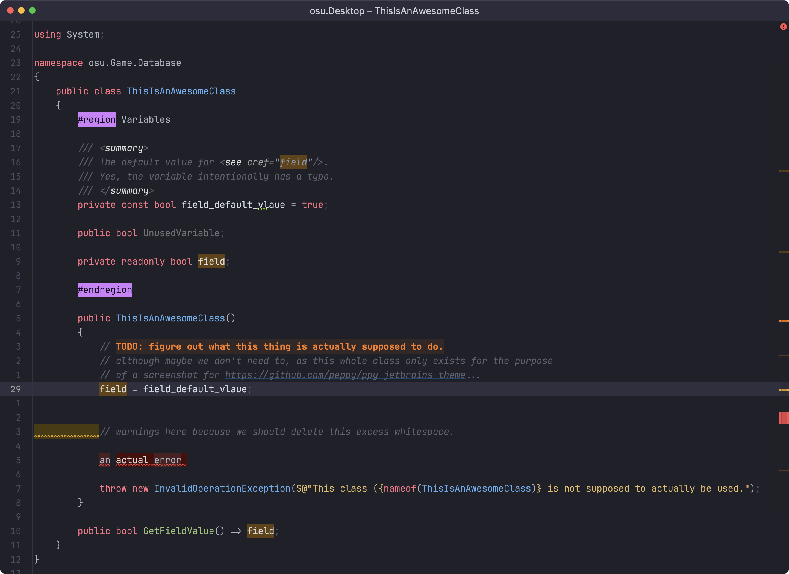
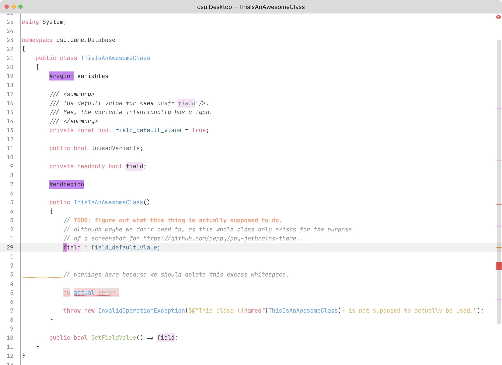

# ppy Jetbrains Theme

<!-- Plugin description -->
A very ppy colour scheme for Rider.

Started in visual studio 10 years ago; adapted gradually to my own needs ever since.

Uses Jetbrains Dark Purple for theme level colours. The real magic is in the syntax colour schemes.
<!-- Plugin description end -->

---

## Dark

## Light

As this is a personal colour scheme, I've focused on applying colour to pieces of the IDE I use.

There is a focus on:

- Jetbrains Rider / c#
- Markdown
- Console

I also use it in Datagrip though.

I'm open to feedback and fixes.

**NOTE: some elements of this theme are a bit broken due to having to change the "parent" skin to make a plugin work. i'll continue to work on it so if you do install this plugin manually, make sure to track new releases.**

---
Plugin based on the [IntelliJ Platform Plugin Template][template].

[template]: https://github.com/JetBrains/intellij-platform-plugin-template
